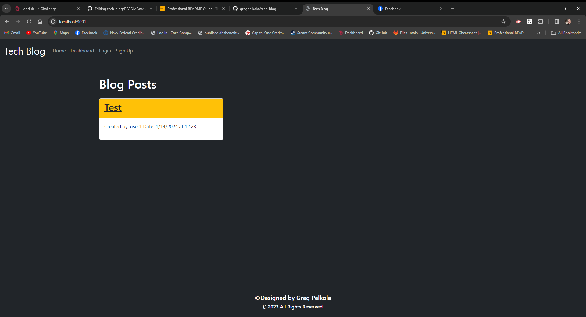
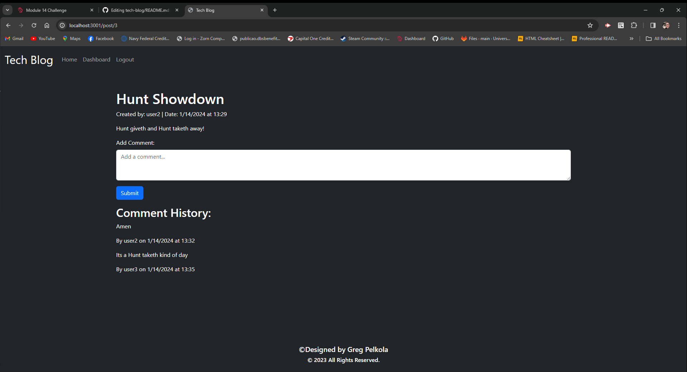

# tech-blog

## Description

Provide a short description explaining the what, why, and how of your project. Use the following questions as a guide:

- What was your motivation?

To create a webpage where users can create, and contribute to a tech blog by making an account and creating a post to the blog so other users can interact with the posts.
  
- Why did you build this project? (Note: the answer is not "Because it was a homework assignment.")

To learn Model View Controllers, and how to apply them to quickly create a function webpage.

- What problem does it solve?

A blog for all things tech, that users can access with an account to interact with other users posts.

- What did you learn?

Model View Controllers, handlebars, .env.

## Table of Contents (Optional)

If your README is long, add a table of contents to make it easy for users to find what they need.

- [Installation](#installation)
- [Usage](#usage)
- [Credits](#credits)
- [License](#license)

## Installation

What are the steps required to install your project? Provide a step-by-step description of how to get the development environment running.

Clone the repository, and open in VSCode or other IDE.

## Usage

Provide instructions and examples for use. Include screenshots as needed.

To start server, run npm start from command line, open browser and navigate to [localhost](http://localhost:3001/). Sign up to create an account, you can use any login from the seeds/userData.js file to complete login. Once logged in you will be able to naviagte to dashboard to create a blog post by clicking on create a new blog post. Enter a title for your blog post, and add content to the blog post once finished, click create blog post. You will be redirected to your dashboard and will see your new blog post. 
You can click on edit post to change title or content of the post, You can click delete post to delete post. Click on the post to view it, you can leave a comment on the post. Home will take you to the home page and will display all posts by users. Logout will logout the current user.

To add a screenshot, create an `assets/images` folder in your repository and upload your screenshot to it. Then, using the relative filepath, add it to your README using the following syntax:

    
    

    
    

## Credits

List your collaborators, if any, with links to their GitHub profiles.

If you used any third-party assets that require attribution, list the creators with links to their primary web presence in this section.

If you followed tutorials, include links to those here as well.

## License

The last section of a high-quality README file is the license. This lets other developers know what they can and cannot do with your project. If you need help choosing a license, refer to [https://choosealicense.com/](https://choosealicense.com/).

---

🏆 The previous sections are the bare minimum, and your project will ultimately determine the content of this document. You might also want to consider adding the following sections.

## Badges

Badges aren't necessary, per se, but they demonstrate street cred. Badges let other developers know that you know what you're doing. Check out the badges hosted by [shields.io](https://shields.io/). You may not understand what they all represent now, but you will in time.

## Features

If your project has a lot of features, list them here.

## How to Contribute

If you created an application or package and would like other developers to contribute it, you can include guidelines for how to do so. The [Contributor Covenant](https://www.contributor-covenant.org/) is an industry standard, but you can always write your own if you'd prefer.

## Tests

Go the extra mile and write tests for your application. Then provide examples on how to run them here.
